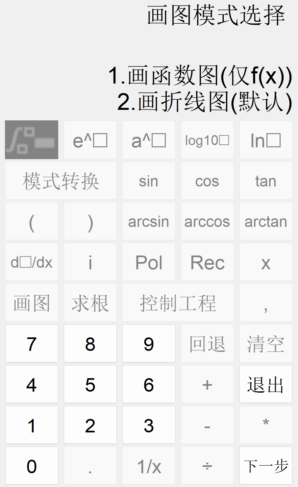
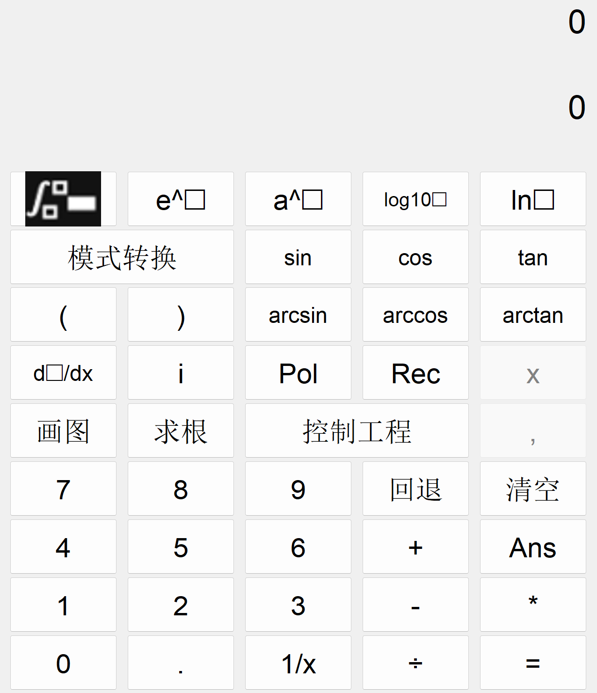
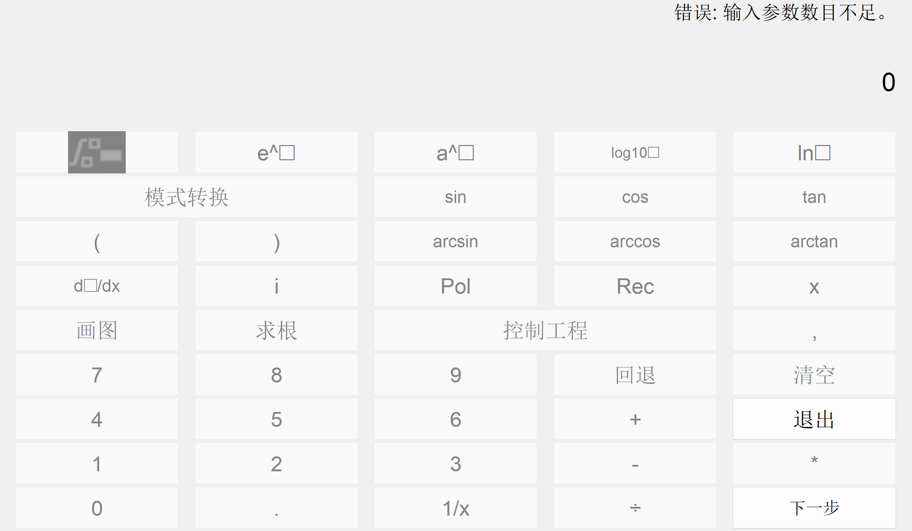

# MathBuddyGUI - MATLAB 计算器 GUI

**MathBuddyGUI** 是一个基于 MATLAB 开发的图形用户界面计算器，除了基础的四则运算外，还支持函数绘图、积分/微分运算、控制系统仿真等高级功能。该项目为 MATLAB 课程设计作业，采用纯代码实现，遵循 GPL-3.0 开源协议。

  
  

## 功能特性

### 基础计算
- **四则运算**: 支持 `+`, `-`, `*`, `/` 及括号优先级。
- **科学计算**: 包含三角函数（`sin`, `cos`, `tan`）、对数（`log`, `log10`）、指数（`e^x`, `a^x`）等。
- **复数运算**: 支持复数输入（如 `3+4i`）及极坐标/直角坐标转换（`Pol`/`Rec`）。
- **历史记录**: 使用 `Ans` 键调用上一次计算结果。

### 高级功能
- **函数绘图**:
  - 折线图：输入离散点 `(x,y)` 绘制。
  - 函数图：输入表达式（如 `sin(x)`）及坐标范围自动生成图像。
- **微积分**:
  - **积分**: 支持定积分（输入上下限）和不定积分。
  - **求导**: 计算表达式导数并支持数值代入。
- **控制系统仿真**:
  - 设置前向/反馈通路传递函数。
  - 分析阶跃响应、冲激响应、伯德图、零极点图。
- **方程求根**: 输入方程表达式求解析解或数值解。

### 模式设置
- **显示精度**: 支持 `long`/`short`/科学计数法/分数格式。
- **复数格式**: `a+bi` 或极坐标 `A∠φ`。
- **角度单位**: 角度制 (°) 或弧度制 (rad)。

## 快速开始

### 环境要求
- `MATLAB R2018b` 或更高版本。
- 依赖工具箱：`Symbolic Math Toolbox`（积分/求导）、`Control System Toolbox`（控制系统分析）。

### 安装与运行
1. 克隆仓库或下载代码：
   ```bash
   git clone https://github.com/HPC2H2/MathBuddyGUI.git
2. 在 MATLAB 中打开项目文件夹，运行 `Calculator.m` 启动 GUI。

### 使用示例
- **画函数图**:
  1. 点击 `画图`，选择模式 `1.画函数图`。

  2. 输入横纵坐标范围（如 `-10,10`）。

  3. 输入表达式（如 `x^2 + sin(x)`）。

- **控制系统仿真**:

  1. 点击 `控制工程`，依次输入前向/反馈通路分子分母系数。

  2. 设置 PID 参数（默认 `1,0,0`）。

  3. 选择分析类型（阶跃响应、伯德图等）。

## 参与贡献
欢迎提交 Issue 或 Pull Request！请确保代码符合 GPL-3.0 协议。

[📧 联系作者](mailto:hpc2h2@outlook.com)

[🏠 项目地址](https://github.com/HPC2H2/MathBuddyGUI/)
